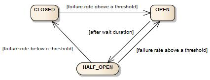

Когда один сервис вызывает другой по сети, вызов может завершиться ошибкой. Причинами ошибки могут быть сетевые проблемы или сбой на вызываемой системе. В любом случае при росте количества ошибок имеет смысл не пытаться выполнить операцию, которая с большой долей вероятности завершится ошибкой. Это с одной стороны позволит системе, которая пытается совершить операцию, не тратить впустую свои ресурсы (например, пул потоков может опустеть из-за того, что все потоки заняты ожиданием ответа от другого сервиса). А с другой стороны это снизит нагрузку на вызываемый сервис, что позволит ему быстрее восстановиться. Такой подход призван не допустить каскадное распространение ошибок по всей системе.

Паттерн Circuit Breaker реализует эту идею. В нём вызов внешней системы (а в общем случае любая операция, которую мы хотим "защитить") оборачивается в специальный объект, Circuit Breaker, который отслеживает результаты выполнения операций. Circuit Breaker представляет собой конечный автомат, имеющий три состояния:
- Closed - запросы выполняются в обычном режиме
- Open - внешняя система недоступна, запросы сразу же завершаются ошибкой, не предпринимается попыток обратиться к защищённому ресурсу
- Half Open - режим восстановления, производится несколько пробных запросов, если ресурс доступен, то Circuit Breaker переходит в состояние Closed

В resilience4j для подсчёта статистики неуспешных запросов используется метод скользящего окна.