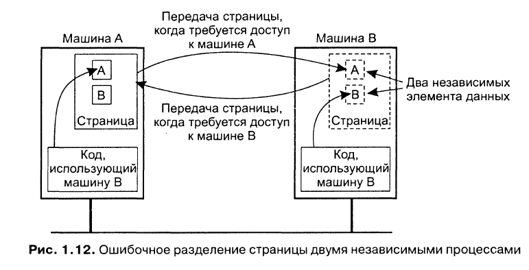

### 1. Определение. Преимущества и недостатки распределённых систем
*Распределённая система* - это набор автономных вычислительных элементов (узлы), который воспринимается пользователями как единая связная система.

Узлы запрограммированы вместе решать общую проблему, это достигается путём обмена сообщениями между ними. Узел реагирует на входящие сообщения, обрабатывает их и выполняет необходимые вычисления, что ведёт к продолжению обмена сообщениями.

Характеристики:
- От пользователей скрыты различия между компьютерами и способы связи между ними
- Легко поддаются расширению и масштабированию. Распределённые системы существуют постоянно, однако некоторые их части могут временно выходить из строя. Пользователи не должны замечать это в процессе работы, а также добавление новых узлов и их удаление

Для поддержания представления компьютеров в виде единой системы, организация распределённых систем часто включает в себя систему промежуточного уровня (middleware), которая располагается между пользовательским уровнем и уровнем ОС.

Преимущества:
- Экономические. Микропроцессоры предлагают лучшее соотношение цена/качество, чем мэйнфреймы
- Производительность. РС может иметь большую суммарную производительность, чем мэйнфрейм
- Унаследованное распределение. Некоторые приложения в сфере банковской деятельности, в сфере логистики, изначально включают в себя географически распределённые компьютеры
- Надёжность. Если 5% компьютеров выйдут из строя, система будет оставаться работоспособной с 5% потерями в производительности
- Пошаговый рост. производительность может наращиваться небольшими порциями
- Разделение данных. Много пользователей могут получить общий доступ к данным
- Разделение устройств. Многие пользователи могут получить доступ к дорогому периферийному оборудованию
- Связь. Делают взаимодействие человек-человек очень лёгким
- Гибкость. Разделяют задачи по всем компьютерам наиболее эффективным образом с точки зрения затрат

Недостатки:
 - Сеть. Наличие сети может добавить другие проблемы
 - Безопасность. Лёгкость доступа относится также и к секретным данным
### 2. Прозрачность в распределённых системах
Распределённые системы, которые представляются пользователям и приложениям в виде единой компьютерной системы, называются прозрачными.

*Прозрачность доступа* - разница в представлении данных и в способах доступа пользователя к ресурсам (endianess, разные представления имён файлов в разных ОС)

*Прозрачность местоположения* - от пользователя скрывается физическое расположение в системе нужного ему ресурса. Это может быть достигнуто присвоением ресурсам логических имён.

*Прозрачность переноса* - смена местоположения не влияет на доступ к ресурсам.

*Прозрачность смены местоположения* - местоположение ресурса может измениться в процессе его использования, и пользователь или приложение ничего не заметят. Пример - мобильные пользователи, работающие с беспроводным переносным компьютером и не отключающиеся от сети при перемещении с места на место.

*Прозрачность репликации* - скрывается тот факт, что существует несколько копий ресурса. Необходимо, чтобы все реплики имели одно и то же имя. Система, поддерживающая прозрачность репликации должна также поддерживать прозрачность местоположения, поскольку иначе будет невозможно обращаться к репликам без указания их истинного местоположения.

*Прозрачность параллельного доступа* - пользователь не знает, что используемый ресурс может быть задействован кем-то другим.

*Прозрачность отказов* - пользователей никогда не уведомляют, что ресурс не в состоянии правильно работать, и о том, что система восстановилась после повреждения.

*Прозрачность сохранности* - маскируются реальная (диск) и виртуальная (оперативная память) сохранности.
```
Так, например, многие объектно-ориентированные базы данных предоставляют
возможность непосредственного вызова методов для сохраненных
объектов. За сценой в этот момент происходит следующее: сервер баз данных
сначала копирует состояние объекта с диска в оперативную память, затем выполняет
операцию и, наконец, записывает состояние на устройство длительного
хранения. Пользователь, однако, остается в неведении о том, что сервер перемещает
данные между оперативной памятью и диском.
```
Существуют ситуации, когда попытки полностью скрыть от пользователя распределённость избыточны и неразумны. Достижение прозрачности распределения - это разумная цель при проектировании и разработке РС, но она не должна рассматриваться в отрыве от других характеристик системы, например производительности.
### 3. Ловушки при разработке РС
Неверные предположения:
- Передача по сети надёжна
- Передача по сети безопасна
- Сеть гомогенна
- Топология не меняется
- Задержки при передаче равны 0
- Полоса пропускания канала бесконечна
- Затраты на передачу нулевые
- Существует один администратор

### 4. Проблемы проектирования РС
1. Надёжность
    - Доступность
    - Отказоустойчивость
2. Производительность
    - Низкоуровневый параллелизм
    - Высокоуровневый параллелизм
3. Масштабируемость
    - Потенциально узкие места в очень больших РС:
        * Централизованные компоненты
        * Централизованные данные
        * Централизованные алгоритмы
    - Необходимо использовать децентрализованные алгоритмы:
        * Ни одна машина не владеет информацией полностью
        * Можно принимать решения только на основе локальной информации
        * Выход из строя одной машины не должен разрушать алгоритм
        * Нет предположения что общее глобальное время существует

### 5. Основы построения РС. Концепция аппаратного обеспечения
**Таксономия Флинна:**
- SISD (single instruction stream, single data stream) - традиционный компьютер фон-Неймановской архитектуры с одним процессором, который выполняет одну инструкцию за другой, работая с одним потоком данных
- SIMD (single instruction stream, multiple data stream) - один процессор загружает одну инструкцию, набор данных для неё, и выполняет операцию над всем набором данных одновременно. Параллельные суперкомпьютеры
- MISD (multiple instruction stream, single data stream) - несколько инструкций оперируют над одним потоком данных. Почти не используется
- MIMD (multiple instuction stream, multiple data stream) - несколько автономных процессоров одновременно выполняют разные инструкции на разных наборах данных. Все распределённые системы


Классификация компьютерных систем с несколькими процессорами:
- Мультипроцессорные - процессоры (компьютеры) используют память совместно, имеют единое адресное пространство
- Мультикомпьютерные - каждый работает со своей памятью

Каждая из этих категорий может быть подразделена на дополнительные категории на основе архитектуры соединяющей их сети:
- Шинная - есть общая среда (шина, кабель, плата), через которую несколько процессоров подключаются к общей памяти
- Коммутируемая - машины связаны каналами, через которые передаются все сообщения. Для передачи каждого сообщения происходит коммутация через специальные устройства

Мультикомпьютерные системы делятся на:
- Гомогенные - одна соединяющая компьютерная сеть, использующая единую технологию. Также одинаковы все процессоры, которые в основном имеют доступ к одинаковым объёмам собственной памяти
- Гетерогенные - множество различных независимых компьютеров, соединённых разнообразными сетями

**Мультипроцессоры.** При большом количестве процессоров, обращающихся к общей памяти, шина может быть перегружена. Решением проблемы является размещение между процессором и шиной высокоскоростной кэш-памяти. При этом возникает проблема несогласованности памяти, что усложняет программирование системы.

При большом количестве процессоров даже при использовании кэша возникает проблема производительности (системы с более чем 256 процессорами). Один из вариантов - разделить общую память на модули и связать их с процессорами через коммутирующую решётку.


Каждое пересечение это узловой коммутатор, который открывается аппаратно, когда процессор пытается получить доступ к модулю памяти. Если два процессора одновременно хотят получить доступ к одному модулю памяти, то одному из них придётся ждать. Если у нас n процессоров и n модулей памяти, то понадобится n<sup>2</sup> узловых коммутаторов, при больших n это может превышать доступные ресурсы. В таких случаях используют омега-сеть. В ней каждый коммутатор может соединять любой вход с любым выходом.
**Гомогенные мультикомпьютерные системы.** В коммутируемых мультикомпьютерных системах сообщения, передаваемые от процессора к процессору, маршрутизируются в соединительной сети. Есть разные топологии их соединения:


Каждая вершина - это процессор, каждое ребро - связь между двумя процессорами.
```
При наличии тысяч процессоров каждую неделю как минимум несколько
будут выходить из строя. Нельзя допустить, чтобы поломка одного из
них приводила к выводу из строя всей машины.
```
**Гетерогенные мультикомпьютерные системы:**
- Размер памяти, тип процессора, быстродействие не важны
- Связь через локальные сети или интернет

### 6. Основы построения РС. Системы с разделяемой памятью
Операционные системы для РС можно разделить на две категории: распределённые ОС (Distributed Operating System, DOS) и сетевые ОС (Network Operating System, NOS). Для поддержки прозрачности распределения к NOS добавляют системы промежуточного уровня (middleware).

Система | Описание | Основное назначение
--- | --- | ---
DOS | Сильно связанные ОС для мультипроцессоров и гомогенных мультикомпьютерных сетей | Сокрытие и управление аппаратным обеспечением
NOS | Слабо связанные ОС для гетерогенных мультикомпьютерных систем (локальных или глобальных систем) | Предоставление локальных служб удалённым клиентам
Middleware | Дополнительный уровень поверх сетевых ОС, реализующий службы общего назначения | Обеспечение прозрачности распределения

**ОС для однопроцессорных компьютеров.** Основная задача - организация лёгкого доступа пользователей и приложений к разделяемым устройствам (процессор, память, диски, периферийные устройства и т. д.). ОС должна полностью контролировать использование и распределение аппаратных ресурсов, поэтому процессоры поддерживают два режима работы: режим ядра (все разрешённые инструкции, доступна вся память и любые регистры) и пользовательский режим (доступ к регистрам и памяти ограничен).

Микроядро - ОС организуется в виде двух частей. Одна часть содержит набор модулей управления аппаратные обеспечением, которые могут выполняться в пользовательском режиме:
```
Например, управление памятью состоит в основном из отслеживания, какие блоки памяти выделены под процессы, а какие свободны
```
Вторая часть ОС содержит небольшое микроядро, содержащее код, выполняющийся исключительно в режиме ядра. Тогда доступ между модулями разграничивается через микроядро:


**Мультипроцессорные ОС.** Несколько процессоров имеют доступ к совместно используемой памяти. Необходимо использовать примитивы синхронизации.

Семафор - целое число и две атомарные операции: up, down. При уменьшении проверяется, превышает ли значение семафора 0. Если это так, значение уменьшается и выполнение продолжается. В противном случае поток блокируется. При увеличении запускается один из заблокированных потоков. Если таких нет, счётчик увеличивается.

Монитор - модуль, содержащий переменные и процедуры. Доступ к переменным только через процедуры, в один момент времени процедуру может выполнять только один поток.
- Используем мониторы для синхронизации доступа
- Более структурированный код по сравнению с семафорами

``` java
monitor Counter {
private:
    int count = 0:
public:
    int value() { return count; }
    void incr() { count = count + 1;}
    void decr() { count = count - 1;}
}
```
Условные переменные - wait и signal.
- Монитор с условием
- wait(x) - предоставляет монитор другим процессам и ожидает события signal(x)

Реализация семафора:
```java
monitor Counter {
private:
    int count = 0;
    int blockecl_procs = 0;
    condition unblocked:
public:
    int value() { return count:}

    void incr() {
        if (blockecl_procs == 0) {
            count = count + 1;
        } else {
            signal( unblocked );
        }
    }

    void decr() {
        if (count == 0) {
            blocked_procs = blocked_procs + 1;
            wait( unblocked ):
            blocked_procs = blocked_procs - 1;
        } else {
            count = count - 1:
        }
    }
}
```
**Мультикомпьютерные ОС.** Каждый узел имеет своё ядро, которое содержит модули для управления локальными ресурсами. Отсутствие общей разделяемой памяти.


Поверх каждого локального ядра лежит уровень ПО общего назначения, реализующий ОС в виде машины, поддерживающей параллельную работу над различными задачами.

Буферизация и синхронизация при отправке сообщений:


Точка синхронизации | Буферизация отправителя | Гарантия надёжной связи
--- | --- | ---
 Блокировка отправителя до наличия свободного места в буфере | Да | Нет необходимости
 Блокировка отправителя до посылки сообщения | Нет | Нет необходимости
 Блокировка отправителя до приёма сообщения | Нет | Необходима
 Блокировка отправителя до обработки сообщения | Нет | Необходима

**Системы с распределённой разделяемой памятью.** Адресное пространство разделено на страницы, распределённые по всем процессорам системы. Когда процессор адресуется к памяти, которая не является локальной, происходит внутреннее прерывание, ОС считывает в локальную память страницу, содержащую указанный адрес, и перезапускает выполнение вызвавшей прерывание инструкции.


Если страница содержит данные двух независимых процессов, выполняющихся на разных процессорах, ОС будет вынуждена постоянно пересылать эту страницу от одного процессора к другому:



### 7. Основы построения РС. Сетевые ОС
Сетевые ОС не нуждаются в том, чтобы аппаратное обеспечение, на котором они функционируют, было гомогенно и управлялось как единая система. Машины и их ОС могут быть разными, но все они соединены в сеть. Сетевая ОС позволяет пользователям использовать сервисы, расположенные на конкретной машине.


Сервисы: удалённое подключение, копирование файлов, глобальная общая файловая система.

**Глобальная общая файловая система.** Файловая система поддерживается одной или несколькими машинами, которые называются файловыми серверами. Файловые серверы принимают запросы от клиентов на чтение и запись:


Рабочие станции могут импортировать или монтировать эти файловые системы, увеличивая свою локальную ФС за счёт ФС сервера.
- Разные клиенты монтируют ФС по-разному
- Разные клиенты могут иметь разное представление ФС (различное именование файлов, организация доступа и т. д.). Поскольку каждая клиентская машина работает относительно независимо от других, невозможно дать какие-то гарантии, что они обладают одинаковой иерархией каталогов для своих программ. Отсюда получается **Неполная прозрачность**

### 8. Основы построения РС. Промежуточный уровень. Модели и сервисы промежуточного уровня