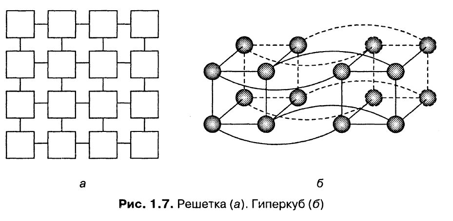
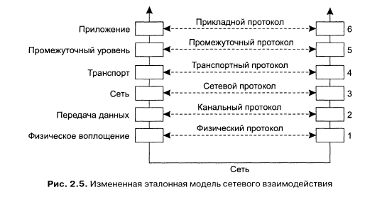

### 1. Определение. Преимущества и недостатки распределённых систем
*Распределённая система* - это набор автономных вычислительных элементов (узлы), который воспринимается пользователями как единая связная система.

Узлы запрограммированы вместе решать общую проблему, это достигается путём обмена сообщениями между ними. Узел реагирует на входящие сообщения, обрабатывает их и выполняет необходимые вычисления, что ведёт к продолжению обмена сообщениями.

Характеристики:
- От пользователей скрыты различия между компьютерами и способы связи между ними
- Легко поддаются расширению и масштабированию. Распределённые системы существуют постоянно, однако некоторые их части могут временно выходить из строя. Пользователи не должны замечать это в процессе работы, а также добавление новых узлов и их удаление

Для поддержания представления компьютеров в виде единой системы, организация распределённых систем часто включает в себя систему промежуточного уровня (middleware), которая располагается между пользовательским уровнем и уровнем ОС.

Преимущества:
- Экономические. Микропроцессоры предлагают лучшее соотношение цена/качество, чем мэйнфреймы
- Производительность. РС может иметь большую суммарную производительность, чем мэйнфрейм
- Унаследованное распределение. Некоторые приложения в сфере банковской деятельности, в сфере логистики, изначально включают в себя географически распределённые компьютеры
- Надёжность. Если 5% компьютеров выйдут из строя, система будет оставаться работоспособной с 5% потерями в производительности
- Пошаговый рост. производительность может наращиваться небольшими порциями
- Разделение данных. Много пользователей могут получить общий доступ к данным
- Разделение устройств. Многие пользователи могут получить доступ к дорогому периферийному оборудованию
- Связь. Делают взаимодействие человек-человек очень лёгким
- Гибкость. Разделяют задачи по всем компьютерам наиболее эффективным образом с точки зрения затрат

Недостатки:
 - Сеть. Наличие сети может добавить другие проблемы
 - Безопасность. Лёгкость доступа относится также и к секретным данным
### 2. Прозрачность в распределённых системах
Распределённые системы, которые представляются пользователям и приложениям в виде единой компьютерной системы, называются прозрачными.

*Прозрачность доступа* - разница в представлении данных и в способах доступа пользователя к ресурсам (endianess, разные представления имён файлов в разных ОС)

*Прозрачность местоположения* - от пользователя скрывается физическое расположение в системе нужного ему ресурса. Это может быть достигнуто присвоением ресурсам логических имён.

*Прозрачность переноса* - смена местоположения не влияет на доступ к ресурсам.

*Прозрачность смены местоположения* - местоположение ресурса может измениться в процессе его использования, и пользователь или приложение ничего не заметят. Пример - мобильные пользователи, работающие с беспроводным переносным компьютером и не отключающиеся от сети при перемещении с места на место.

*Прозрачность репликации* - скрывается тот факт, что существует несколько копий ресурса. Необходимо, чтобы все реплики имели одно и то же имя. Система, поддерживающая прозрачность репликации должна также поддерживать прозрачность местоположения, поскольку иначе будет невозможно обращаться к репликам без указания их истинного местоположения.

*Прозрачность параллельного доступа* - пользователь не знает, что используемый ресурс может быть задействован кем-то другим.

*Прозрачность отказов* - пользователей никогда не уведомляют, что ресурс не в состоянии правильно работать, и о том, что система восстановилась после повреждения.

*Прозрачность сохранности* - маскируются реальная (диск) и виртуальная (оперативная память) сохранности.
```
Так, например, многие объектно-ориентированные базы данных предоставляют
возможность непосредственного вызова методов для сохраненных
объектов. За сценой в этот момент происходит следующее: сервер баз данных
сначала копирует состояние объекта с диска в оперативную память, затем выполняет
операцию и, наконец, записывает состояние на устройство длительного
хранения. Пользователь, однако, остается в неведении о том, что сервер перемещает
данные между оперативной памятью и диском.
```
Существуют ситуации, когда попытки полностью скрыть от пользователя распределённость избыточны и неразумны. Достижение прозрачности распределения - это разумная цель при проектировании и разработке РС, но она не должна рассматриваться в отрыве от других характеристик системы, например производительности.
### 3. Ловушки при разработке РС
Неверные предположения:
- Передача по сети надёжна
- Передача по сети безопасна
- Сеть гомогенна
- Топология не меняется
- Задержки при передаче равны 0
- Полоса пропускания канала бесконечна
- Затраты на передачу нулевые
- Существует один администратор

### 4. Проблемы проектирования РС
1. Надёжность
    - Доступность
    - Отказоустойчивость
2. Производительность
    - Низкоуровневый параллелизм
    - Высокоуровневый параллелизм
3. Масштабируемость
    - Потенциально узкие места в очень больших РС:
        * Централизованные компоненты
        * Централизованные данные
        * Централизованные алгоритмы
    - Необходимо использовать децентрализованные алгоритмы:
        * Ни одна машина не владеет информацией полностью
        * Можно принимать решения только на основе локальной информации
        * Выход из строя одной машины не должен разрушать алгоритм
        * Нет предположения что общее глобальное время существует

### 5. Основы построения РС. Концепция аппаратного обеспечения
**Таксономия Флинна:**
- SISD (single instruction stream, single data stream) - традиционный компьютер фон-Неймановской архитектуры с одним процессором, который выполняет одну инструкцию за другой, работая с одним потоком данных
- SIMD (single instruction stream, multiple data stream) - один процессор загружает одну инструкцию, набор данных для неё, и выполняет операцию над всем набором данных одновременно. Параллельные суперкомпьютеры
- MISD (multiple instruction stream, single data stream) - несколько инструкций оперируют над одним потоком данных. Почти не используется
- MIMD (multiple instuction stream, multiple data stream) - несколько автономных процессоров одновременно выполняют разные инструкции на разных наборах данных. Все распределённые системы


Классификация компьютерных систем с несколькими процессорами:
- Мультипроцессорные - процессоры (компьютеры) используют память совместно, имеют единое адресное пространство
- Мультикомпьютерные - каждый работает со своей памятью

Каждая из этих категорий может быть подразделена на дополнительные категории на основе архитектуры соединяющей их сети:
- Шинная - есть общая среда (шина, кабель, плата), через которую несколько процессоров подключаются к общей памяти
- Коммутируемая - машины связаны каналами, через которые передаются все сообщения. Для передачи каждого сообщения происходит коммутация через специальные устройства

Мультикомпьютерные системы делятся на:
- Гомогенные - одна соединяющая компьютерная сеть, использующая единую технологию. Также одинаковы все процессоры, которые в основном имеют доступ к одинаковым объёмам собственной памяти
- Гетерогенные - множество различных независимых компьютеров, соединённых разнообразными сетями

**Мультипроцессоры.** При большом количестве процессоров, обращающихся к общей памяти, шина может быть перегружена. Решением проблемы является размещение между процессором и шиной высокоскоростной кэш-памяти. При этом возникает проблема несогласованности памяти, что усложняет программирование системы.

При большом количестве процессоров даже при использовании кэша возникает проблема производительности (системы с более чем 256 процессорами). Один из вариантов - разделить общую память на модули и связать их с процессорами через коммутирующую решётку.


Каждое пересечение это узловой коммутатор, который открывается аппаратно, когда процессор пытается получить доступ к модулю памяти. Если два процессора одновременно хотят получить доступ к одному модулю памяти, то одному из них придётся ждать. Если у нас n процессоров и n модулей памяти, то понадобится n<sup>2</sup> узловых коммутаторов, при больших n это может превышать доступные ресурсы. В таких случаях используют омега-сеть. В ней каждый коммутатор может соединять любой вход с любым выходом.
**Гомогенные мультикомпьютерные системы.** В коммутируемых мультикомпьютерных системах сообщения, передаваемые от процессора к процессору, маршрутизируются в соединительной сети. Есть разные топологии их соединения:



Каждая вершина - это процессор, каждое ребро - связь между двумя процессорами.
```
При наличии тысяч процессоров каждую неделю как минимум несколько
будут выходить из строя. Нельзя допустить, чтобы поломка одного из
них приводила к выводу из строя всей машины.
```
**Гетерогенные мультикомпьютерные системы:**
- Размер памяти, тип процессора, быстродействие не важны
- Связь через локальные сети или интернет

### 6. Основы построения РС. Системы с разделяемой памятью
Операционные системы для РС можно разделить на две категории: распределённые ОС (Distributed Operating System, DOS) и сетевые ОС (Network Operating System, NOS). Для поддержки прозрачности распределения к NOS добавляют системы промежуточного уровня (middleware).

Система | Описание | Основное назначение
--- | --- | ---
DOS | Сильно связанные ОС для мультипроцессоров и гомогенных мультикомпьютерных сетей | Сокрытие и управление аппаратным обеспечением
NOS | Слабо связанные ОС для гетерогенных мультикомпьютерных систем (локальных или глобальных систем) | Предоставление локальных служб удалённым клиентам
Middleware | Дополнительный уровень поверх сетевых ОС, реализующий службы общего назначения | Обеспечение прозрачности распределения

**ОС для однопроцессорных компьютеров.** Основная задача - организация лёгкого доступа пользователей и приложений к разделяемым устройствам (процессор, память, диски, периферийные устройства и т. д.). ОС должна полностью контролировать использование и распределение аппаратных ресурсов, поэтому процессоры поддерживают два режима работы: режим ядра (все разрешённые инструкции, доступна вся память и любые регистры) и пользовательский режим (доступ к регистрам и памяти ограничен).

Микроядро - ОС организуется в виде двух частей. Одна часть содержит набор модулей управления аппаратные обеспечением, которые могут выполняться в пользовательском режиме:
```
Например, управление памятью состоит в основном из отслеживания, какие блоки памяти выделены под процессы, а какие свободны
```
Вторая часть ОС содержит небольшое микроядро, содержащее код, выполняющийся исключительно в режиме ядра. Тогда доступ между модулями разграничивается через микроядро:


**Мультипроцессорные ОС.** Несколько процессоров имеют доступ к совместно используемой памяти. Необходимо использовать примитивы синхронизации.

Семафор - целое число и две атомарные операции: up, down. При уменьшении проверяется, превышает ли значение семафора 0. Если это так, значение уменьшается и выполнение продолжается. В противном случае поток блокируется. При увеличении запускается один из заблокированных потоков. Если таких нет, счётчик увеличивается.

Монитор - модуль, содержащий переменные и процедуры. Доступ к переменным только через процедуры, в один момент времени процедуру может выполнять только один поток.
- Используем мониторы для синхронизации доступа
- Более структурированный код по сравнению с семафорами

``` java
monitor Counter {
private:
    int count = 0:
public:
    int value() { return count; }
    void incr() { count = count + 1;}
    void decr() { count = count - 1;}
}
```
Условные переменные - wait и signal.
- Монитор с условием
- wait(x) - предоставляет монитор другим процессам и ожидает события signal(x)

Реализация семафора:
```java
monitor Counter {
private:
    int count = 0;
    int blockecl_procs = 0;
    condition unblocked:
public:
    int value() { return count:}

    void incr() {
        if (blockecl_procs == 0) {
            count = count + 1;
        } else {
            signal( unblocked );
        }
    }

    void decr() {
        if (count == 0) {
            blocked_procs = blocked_procs + 1;
            wait( unblocked ):
            blocked_procs = blocked_procs - 1;
        } else {
            count = count - 1:
        }
    }
}
```
**Мультикомпьютерные ОС.** Каждый узел имеет своё ядро, которое содержит модули для управления локальными ресурсами. Отсутствие общей разделяемой памяти.


Поверх каждого локального ядра лежит уровень ПО общего назначения, реализующий ОС в виде машины, поддерживающей параллельную работу над различными задачами.

Буферизация и синхронизация при отправке сообщений:


Точка синхронизации | Буферизация отправителя | Гарантия надёжной связи
--- | --- | ---
 Блокировка отправителя до наличия свободного места в буфере | Да | Нет необходимости
 Блокировка отправителя до посылки сообщения | Нет | Нет необходимости
 Блокировка отправителя до приёма сообщения | Нет | Необходима
 Блокировка отправителя до обработки сообщения | Нет | Необходима

**Системы с распределённой разделяемой памятью.** Адресное пространство разделено на страницы, распределённые по всем процессорам системы. Когда процессор адресуется к памяти, которая не является локальной, происходит внутреннее прерывание, ОС считывает в локальную память страницу, содержащую указанный адрес, и перезапускает выполнение вызвавшей прерывание инструкции.


Если страница содержит данные двух независимых процессов, выполняющихся на разных процессорах, ОС будет вынуждена постоянно пересылать эту страницу от одного процессора к другому:


### 7. Основы построения РС. Сетевые ОС
Сетевые ОС не нуждаются в том, чтобы аппаратное обеспечение, на котором они функционируют, было гомогенно и управлялось как единая система. Машины и их ОС могут быть разными, но все они соединены в сеть. Сетевая ОС позволяет пользователям использовать сервисы, расположенные на конкретной машине.


Сервисы: удалённое подключение, копирование файлов, глобальная общая файловая система.

**Глобальная общая файловая система.** Файловая система поддерживается одной или несколькими машинами, которые называются файловыми серверами. Файловые серверы принимают запросы от клиентов на чтение и запись:


Рабочие станции могут импортировать или монтировать эти файловые системы, увеличивая свою локальную ФС за счёт ФС сервера.
- Разные клиенты монтируют ФС по-разному
- Разные клиенты могут иметь разное представление ФС (различное именование файлов, организация доступа и т. д.). Поскольку каждая клиентская машина работает относительно независимо от других, невозможно дать какие-то гарантии, что они обладают одинаковой иерархией каталогов для своих программ. Отсюда получается **Неполная прозрачность**

### 8. Основы построения РС. Промежуточный уровень. Модели и сервисы промежуточного уровня
Ни DOS, ни NOS не позволяют создавать РС, одновременно удовлетворяющие требованиям атомарности узлов и согласованности их работы. DOS не предназначены для управления набором независимых компьютеров, а NOS не дают представления одной согласованной системы. Для решения этой проблемы используется ПО промежуточного уровня (middleware).

**Позиционирование ПО промежуточного уровня**. ПО промежуточного уровня используется в сетевых операционных системах для того, чтобы скрыть разнородность набора аппаратных платформ и повысить прозрачность распределения. Оно находится посередине между уровнем приложений и уровнем сетевой ОС:


Каждая локальная система, составляющая часть сетевой ОС, отвечает за управление локальными ресурсами и предоставляет базовые коммуникационные средства для связи с другими компьютерами. Основная задача ПО промежуточного уровня - скрыть разнообразие базовых платформ от приложений.

**Модели промежуточного уровня:**
- Распределённая файловая система
- Механизм вызова удалённых процедур (RPC)
- Модель распределённых объектов
- Модель распределённых документов (WWW)
- Микросервисная архитектура

**Сервисы промежуточного уровня:**
- Высокоуровневые средства связи
- Сервис именования
- Средства хранения данных
- Распределённые транзакции
- Средства обеспечения защиты
- Средства виртуализации и контейнеризации

**Промежуточный уровень и открытость.** Современные РС создаются в виде систем промежуточного уровня для нескольких платформ. При этом приложения создаются для конкретной РС и не зависят от платформы (т. е. от ОС). Однако неполнота описания интерфейса ПО промежуточного уровня может привести к следующим проблемам:
- Разработчики вынуждены добавлять свои собственные интерфейсы. Тогда может возникнуть ситуация, в которой в соответствии с одним и тем же стандартом создаются разные системы промежуточного уровня, и приложения, написанные под одну из систем, не могут быть перенесены на другую
- Две реализации ПО промежуточного уровня могут быть основаны на одинаковом наборе интерфейсов, но использовать разные коммуникационные протоколы

Необходимо, чтобы и протоколы промежуточного уровня, и его интерфейсы были одинаковы:


**Сравнение между системами:**

Характеристика | Мультипроц. РС | Мультикомп. РС | Сетевая ОС | РС промеж. уровня
--- | --- | --- | --- | ---
Степень прозрачности | Очень высокая | Высокая | Низкая | Высокая
Идентичность ОС на всех узлах | Поддерж. | Поддерж. | Не поддерж. | Не поддерж.
Число копий ОС | 1 | N | N | N
Коммуникация на основе | Совместно исп. памяти | Сообщений | Файлов | Зависит от модели
Управление ресурсами | Глобальное, централизованное | Глобальное, распределённое | Отдельно на узле | Отдельно на узле
Масштабируемость | Отсутствует | Умеренная | Да | Различная
Открытость | Закрытая | Закрытая | Открытая | Открытая

### 9. Сетевое взаимодействие. Модель клиент-сервер
В модели клиент-сервер все процессы делятся на две группы:
- Серверы - процессы, реализующие некоторую службу
- Клиенты - процессы, которые запрашивают службу у серверов

Взаимодействие клиента и сервера происходит в режиме запрос-ответ:


### 10. Сетевое взаимодействие. Многоуровневая модель. Современные архитектуры.
Три уровня обработки:
- Уровень пользовательского интерфейса - всё необходимое для непосредственного общения с пользователем
- Уровень обработки - содержит приложения
- Уровень данных - содержит данные, с которыми происходит работа

**Пример работы поисковой системы.** Пользовательский интерфейс прост: пользователь вводит строку, состоящую из ключевых строк, и получает список заголовков web-страниц. Результат формируется из БД просмотренных и проиндексированных web-страниц. Уровнем обработки является программа, трансформирующая введённую пользователем строку в один или несколько запросов к БД. Затем результаты отдаются в виде HTML-страницы.


**Физически двухзвенная архитектура.** Один из вариантов организации работы клиентов и серверов - распределение программ уровня приложений по различным машинам. Первый шаг - разделение машин на два типа: клиенты и серверы. Причём ответственность может распределяться по-разному:


**Физически трёхзвенная архитектура.** Серверу иногда может понадобиться работать в качестве клиента, это приводит к физически трёхзвенной архитектуре. Программы, составляющие часть уровня обработки выносятся на отдельный сервер. Типичный пример - обработка транзакций. В этом случае отдельный процесс - монитор транзакций - координирует все транзакции, возможно на нескольких серверах данных.


**Современные архитектуры.** Описанное выше распределение называется *вертикальным*. Оно достигается размещением логически различных компонентов на разных машинах. В современных архитектурах распределение на клиентов и серверы происходит способом, известным, как *горизонтальное распределение*. В нём клиент или сервер может содержать физически разделённые части логически однородного модуля, причём работа с каждой из частей может происходить независимо. Это делается для выравнивания нагрузки. ~~речь про микросервисы?~~

Распространённый пример - web-сервер, реплицированный на несколько машин.


### 11. Модели взаимодействия. Удалённый вызов процедур
**OSI**:


**Пример протокола канального уровня**:


**TCP и T/TCP**:


**Протоколы промежуточного уровня**. К промежуточному уровню относятся протоколы, логически помещаемые прикладной уровень, но содержащие множество протоколов общего назначения. Можно отделить отделить высокоуровневые протоколы взаимодействия от протоколов для предоставления различных служб промежуточного уровня. Примеры: аутентификация, блокировка общих ресурсов, распределённые транзакции.



**RPC**. Программам позволяется вызывать процедуры, находящиеся на других машинах. Когда процесс, запущенный на машине A, вызывает процедуру с машины B, вызывающий процесс на машине A приостанавливается, а выполнение вызванной процедуры происходит на машине B. Информация может быть передана от вызывающего процесса к вызываемой процедуре через параметры и возвращена процессу в виде результата выполнения процедуры. Для программиста всё прозрачно - как будто код выполнялся локально.

**Заглушки для клиента и сервера.** В клиенте используется специальная версия функции, называемая клиентской заглушкой. Её вызов происходит точно также, как и вызов любой другой функции. Она упаковывает переданные параметры в сообщение и отправляет на сервер и блокируется до получения ответа. Когда сообщение приходит на сервер, ОС сервера передаёт его серверной заглушке, которая преобразует входящие по сети запросы в вызовы процедур. После получения запроса серверная заглушка распаковывает его, извлекая параметры, и передаёт их в процедуру сервиса. Далее серверная заглушка упаковывает результат вызова в сообщение и отсылает его клиенту.


При удалённом вызове процедур происходят следующие действия:
1. Процедура клиента обычным образом вызывает клиентскую заглушку
2. Клиентская заглушка создаёт сообщение и вызывает локальную ОС
3. ОС клиента пересылает сообщение удалённой ОС
4. Удалённая ОС передаёт сообщение серверной заглушке
5. Серверная заглушка извлекает из сообщения параметры и вызывает сервер
6. Сервер выполняет вызов и возвращает результаты серверной заглушке
7. Серверная заглушка запаковывает результаты в сообщение и вызывает свою локальную ОС
8. ОС сервера пересылает сообщение ОС клиента
9. ОС клиента принимает сообщение и передаёт его клиентской заглушке
10. Клиентская заглушка извлекает результаты из сообщения и передаёт их клиенту

**Передача параметров.** Упаковка параметров в сообщение носит название маршалинга параметров. Также вместе с параметрами посылается имя вызываемой процедуры:


До тех пор пока машины клиента и сервера идентичны, а все параметры и результаты имеют скалярный тип, эта модель работает абсолютно правильно. Однако в больших РС обычно присутствуют машины разных типов. Каждая может иметь разное представление чисел (big endian и little endian), символов (кодовые таблицы) и других элементов данных:


Поэтому клиент и сервер должны следовать одному протоколу с одинаковым представлением типов данных.

**Пример определения формата сообщения**:


**IDL.** Заглушки, работающие по одному протоколу для разных, процедур различаются лишь интерфейсом с приложениями. Интерфейс состоит из набора процедур, которые могут быть вызваны клиентом, но реализуются на сервере. Доступ к интерфейсу осуществляется обычно из определённого языка программирования. Для упрощения работы интерфейса часто описываются с использованием языка определения интерфейсов (Interface Definition Language, IDL). Интерфейс, определённый таким образом, компилируются затем в заглушки клиента и сервера, а также в соответствующие интерфейсы времени компиляции и времени выполнения.

**Облегчённый механизм RPC**. Когда клиент и сервер установлены на одной машине мы должны использовать средства локального межпроцессорного взаимодействия (InterPorcess Comunication, IPC).

Некоторые ОС предоставляют процессам, размещённым на одной машине, эквивалент RPC под названием входы (doors). Вход - это обобщённое имя процедур, существующих в адресном пространстве процессов сервера, которые могут вызываться процессами, размещенными на одной с сервером машине. Для того, чтобы появилась возможность вызвать вход, процесс сервера должен зарегистрировать его. При регистрации возвращается идентификатор, который потом клиент может использовать для доступа к входу.


**Асинхронный вызов RPC**. Клиент получает возможность продолжить свою работу сразу после выполнения запроса RPC. При асинхронном вызове RPC сервер немедленно по приходу запроса отсылает клиенту ответ, после чего вызывает запрошенную процедуру. Ответ служит подтверждением того, что сервер приступил к обработке запроса.


Асинхронные вызовы RPC также полезны в тех случаях, когда ответ будет послан, но клиент не готов просто ждать его, ничего не делая. В подобных случаях имеет смысл организовать сообщение между клиентом и сервером через два асинхронных вызова RPC. Сначала клиент вызывает сервер, чтобы передать запрос, и продолжает свою работу, когда сервер подтверждает получение. Второй вызов делает сервер, который вызывает клиента, чтобы передать результат. Это также называется *отложенным синхронным вызовом RPC (deffered synchronous RPC*).


**Написание клиента и сервера**:


**Привязка клиента к серверу**. Чтобы позволить клиенту вызывать сервер, необходимо, чтобы сервер был зарегистрирован и готов к приёму входящих вызовов. Регистрация сервере даёт клиенту возможность реально обнаружить сервер и выполнить привязку к нему. Обнаружение сервера происходит в два этапа:
1. Обнаружение машины сервера
2. Обнаружение нужного процесса на этой машине (конечная точка или порт)

В DCE (Distributed Computing Environment) на каждой из серверных машин процессом DCE-демон поддерживается таблица пар сервер - конечная точка. Перед тем как сервер станет доступным для входящих запросов, он должен запросить у ОС конечную точку. Далее сервер регистрирует эту конечную точку у DCE-демона. DCT-демон записывает эту информацию в таблицу конечных точек. Сервер также регистрирует предоставленные серверной машине сетевой адрес и имя, под которым сервер будет доступен.


Привязка выполняется в несколько этапов:
1. Регистрация конечной точки
2. Регистрация службы
3. Поиск сервера службы каталогов
4. Запрос конечной точки
5. Выполнение вызова RPC

### 12. Модели взаимодействия. Удалённый вызов объектов
Объект инкапсулирует данные (состояние) и операции над ними (методы). Доступ к методам можно получить через интерфейс. Объект может реализовывать множество интерфейсов, а интерфейс может быть реализован множеством объектов. Такое разделение на интерфейсы и объекты позволяет помещать интерфейс на одну машину, в то время как сам объект находится на другой. Это называется *распределённый объект*.


Когда клиент выполняет привязку к распределённому объекту, в адресное пространство клиента загружается реализация интерфейса объекта, называемая *заместителем (proxy)*. Заместитель клиента аналогичен клиентской заглушке в RPC. Единственное, что он делает - выполняет маршалинг параметров в сообщениях при обращении к методам и демаршалинг данных из ответных сообщений. Сами объекты находятся на сервере и предоставляют клиентской машине необходимые интерфейсы. Входящий на сервер запрос на выполнение метода сначала попадает на серверную заглушку, которая называется *скелетон (skeleton)*. Скелетон преобразует его в обращение к методу через интерфейс объекта на сервере. Серверная заглушка затем выполняет маршалинг ответа и пересылку его заместителю клиента.

Состояние объекта не распределяется - оно локализовано на одной машине.

**Передача параметров**. Если все объекты распределённые, то они доступны со всех машин в системе. В этом случае при обращении к методу можно использовать ссылки на объекты как параметры. Ссылки передаются по значению и копируются с одной машины на другую. Если ссылка относится к локальному объекту, то есть к объекту в адресном пространстве клиента, то объект, на который указывает ссылка, целиком копируется и в процессе обращения передаётся серверу. Другими словами, объект передаётся по значению.


**Модель распределённых объектов DCE**. Поддерживается два типа распределённых объектов. *Динамические распределённые объекты (distributed dynamic objects)* - это объекты, которые создаются сервером локально по требованию клиента и к которым в принципе имеет доступ один клиент. *Именованные распределённые объекты (distributed named objects)* создаются сервером для совместного использования несколькими клиентами. Именованные объекты регистрируются службой каталогов, так что клиент может найти объект и выполнить привязку к нему.


### 13. Модели взаимодействия. Использование очереди сообщений
Использование RPC и RMI затруднено в условиях, когда нет уверенности, что принимающая сторона в момент передачи сообщения всегда будет работать. Альтернатива - очереди сообщений. Рассмотрим пример организации компьютерной сети:


Приложения всегда выполняются на хостах, а каждый хост предоставляет интерфейс с коммуникационной системой, через которую передаются сообщения. Хосты соединены сетью коммуникационных серверов, которые отвечают за передачу сообщений между хостами. Буферы могут быть размещены как на хостах, так и на коммуникационных серверах.

**Сохранная связь**. При сохранной связи сообщение, предназначенное для отсылки, хранится в коммуникационной систему до тех пор, пока его не удастся передать получателю. Система сохранной связи сравнима по принципу работы с почтовой системой:


**Нерезидентная связь**. Сообщение хранится в системе только во время работы приложений, которые отправляют и принимают это сообщение. Коммуникационный сервер, не имея возможности передать сообщение следующему серверу, уничтожает его.

**Синхронная и асинхронная связь**. *Асинхронная связь* - немедленное после отправки сообщения продолжение работы отправителя. Сообщение сохраняется в локальном буфере передающего хоста или на ближайшем коммуникационном сервере. *Синхронная связь* - отправитель блокируется до того момента, пока его сообщение не будет сохранено в локальном буфере принимающего хоста или доставлено реальному получателю. Наиболее жёсткая форма синхронного взаимодействия предполагает, что отправитель остаётся блокированным и на время обработки его сообщения получателем.

Примеры комбинаций:
- Сохранная асинхронная - электронная почта
- Нерезидентная асинхронная - UDP и другие службы дейтаграмм транспортного уровня, асинхронный вызов RPC
- Нерезидентная синхронная связь- RPC и RMI


**Сокеты Беркли**. Это программный интерфейс транспортного уровня, использующийся в UNIX. *Сокет (socket)* - это конечная точка коммуникации. В эту точку приложение может записывать данные, которые стоит переслать по базовой сети, и из этой точки оно может читать исходящие данные.

Примитивы сокетов для TCP/IP:

Примитив | Назначение
--- | ---
Socket | Создать новую конечную точку коммуникации
Bind | Назначить сокету локальный адрес
Listen | Обозначить готовность к установке соединения
Accept | Заблокировать вызывающую сторону до прибытия запроса о соединении
Connect | Совершить попытку установить соединение
Send | Послать через соединение некоторые данные
Receive | Принять из соединения некоторые данные
Close | Разорвать соединение


**Интерфейс передачи сообщений (MPI)**:


**Модель очереди сообщений**. Основная идея, лежащая в основе систем очередей сообщений, состоит в том, что приложения общаются между собой путём помещения сообщений в специальные очереди. Отправитель обычно в состоянии гарантировать только попадание сообщения - рано или поздно - в очередь получателя. Никакие гарантии относительно того, будет ли сообщение действительно прочитано, невозможны, это полностью определяется поведением получателя. Это определяет слабосвязанное взаимодействие. У получателя нет необходимости быть активным, когда сообщение пересылается в его очередь. Точно так же нет нужды в активности отправителя в момент обработки сообщения получателем. Отправитель и получатель могут выполняться абсолютно независимо друг от друга.


Базовый интерфейс, предоставляемый приложениям:

Примитив | Назначение
--- | ---
Put | Добавить сообщение в соответствующую очередь
Get | Приостановить работу до тех пор, пока в соответствующей очереди не появится сообщения, затем извлечь первое сообщение
Poll | Проверить наличие сообщений в соответствующей очереди, затем извлечь первое из них. Ничего не блокировать
Notify | Вставить дескриптор функции, которая будет вызвана при помещении сообщения в соответствующую очередь

**Общая архитектура системы очередей сообщений**. Сделаем ограничение, состоящее в том, что сообщение может быть помещено только в локальную очередь отправителя - в *исходящую очередь (source queue)*. Аналогично, прочитать сообщение можно только из локальной очереди - из *очереди назначения (destination queue)*. В обязанности системы очередей сообщений входит предоставление очередей отправителям и получателям и обеспечение перемещения сообщений из исходящий очередей в очереди назначения.

Набор очередей разнесён по множеству разных машин. Чтобы система очередей сообщений могла перемещать сообщения, она должна поддерживать отображение очередей на сетевые адреса. На практике это означает, что она должна поддерживать базу данных *имён очередей (queue names)*.


Во многих системах очередей сообщений не существует общих служб именования, которые могли бы динамически поддерживать отображение имён очередей на адреса. Тогда можно использовать несколько маршрутизаторов, имеющих информацию о топологии сети. Когда отправитель помещает в локальную очередь сообщение, это сообщение в сначала передаётся на ближайший маршрутизатор. При этом маршрутизатор знает, что делать с этим сообщением и передаёт его следующему маршрутизатору в направлении получателя. Таким образом, при добавлении или удалении очередей обновление информации потребуется только маршрутизаторам, в то время как остальным менеджерам очередей достаточно будет знать только местоположение ближайшего маршрутизатора.


**Брокеры сообщений**. Каждый раз, когда в систему добавляется новое сообщение, оно привносит в неё свой специфический формат сообщений, и каждый потенциальный получатель должен научиться понимать этот формат. В системах очередей сообщений преобразование производится на специальных узлах сети - *брокерах сообщений (message brokers).* Основная задача брокеров сообщений - преобразование входящих сообщений в формат, который понимается целевым приложением.


**IBM MQSeries**.


*Канал сообщений* - это ненаправленное надёжное соединение между отправляющим и принимающим менеджерами очередей, по которому передаются находящиеся в очереди сообщения.


Организация сети:


Известные протоколы:
- JMS (Java Message API)
- AMQP (Advanced Message Queuing Protocol)
- MQTT (Message Queuing Telemetry Transport)
- STOMP (Streaming Text Oriented Messaging Protocol)

Известные реализации:
- Windows Message Queues
- Apache Kafka
- RabbitMQ
- ZeroMQ
- ActiveMQ
- ESB (Enterprise Service Bus)
- Apache Camel

### 14. Модели взаимодействия. Потоки данных